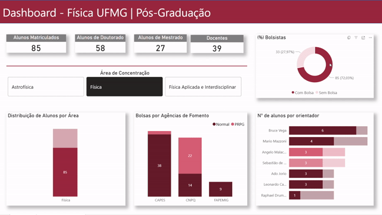
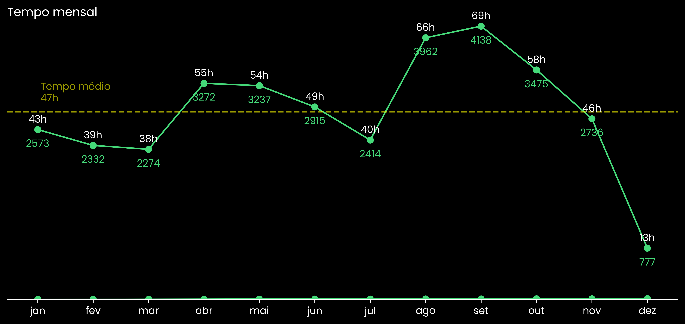
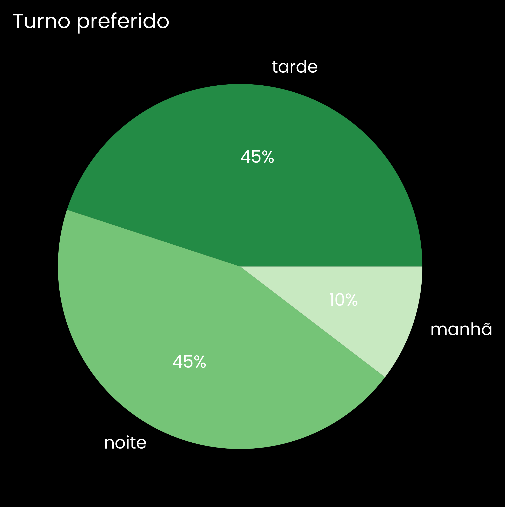

# 💼 Projetos em Dados 

    <a href="https://www.linkedin.com/in/joaovictorcamposcosta" target="_blank">
        
        <strong>João Victor Campos</strong>
    </a>
     
    Mestrando em Física • Transição para Data Science & Analytics

**Python • Power BI • Streamlit • SQL • Git/Github**

  <a href="#1-dashboard-pós-graduação-em-física-ufmg">Dashboard Pós-Graduação em Física</a> •
  <a href="#2-spotify---dados-pessoais">Spotify Wrapped "Home Made"</a>

<blockquote>
Este repositório reúne projetos do meu portfólio com foco em:  

- **pipeline reprodutível** (extração → limpeza → análise → entrega)  
- **perguntas claras** e respostas com métricas/visuais  
- **organização** e **documentação** para facilitar leitura e execução. 

</blockquote>

<h1><a href="https://app.powerbi.com/reportEmbed?reportId=280e166c-af3a-4da4-881a-7f6a93304ed3&autoAuth=true&ctid=64126139-4352-4cd7-b1fb-2a971c6f69a6">Dashboard Pós-Graduação em Física (UFMG)</a></h1>

  
  

### Contexto e objetivo
A transparência na composição do corpo discente é fundamental para um bom funcionamento de um
programa de Pós-Graduação. Nesse sentido, esta análise tem como objetivo responder às principais
dúvidas de alunos interessados em ingressar no Departamento de Física, bem como fornecer aos
docentes e discentes atuais uma visão mais clara do ambiente acadêmico em que estão inseridos.

A partir de dados públicos do programa, o projeto busca organizar e apresentar informações de forma
acessível, apoiando a compreensão do perfil discente e auxiliando a tomada de decisão institucional.
As principais perguntas abordadas são:

- Quantos alunos há por **modalidade** (Mestrado/Doutorado)?
  - **Resposta**: Dos 152 alunos matriculados, 83 são do Doutorado e 69 de Mestrado.

- Qual a distribuição de alunos por **área de concentração**?
  - A **Física** e a maior área de concentração com 118 alunos, seguida da Física Aplicada e Interdisciplinar com 19 alunos e Astrofísica com 15 alunos.  

- Quantos alunos são **bolsistas** e quais **agências** financiam?
  - Dos 152 alunos, 108 (71,05%) são bolsistas e 44 alunos (28.95%) estão sem bolsas de estudos. As agências financiadoras do programa são CAPES, CNPQ e FAPEMIG. Existem apenas 12 bolsas FAPEMIG em todo o programa e a maioria das bolsas CNPQ são advindas da PRPG.

- Como está a distribuição de orientandos por **orientador(a)**?
  - Os orientadores com mais alunos do programa são os professores Bruce Vega e Mário Sérgio Mazzoni com **7 alunos cada um**. Em segundo lugar o prof. Ângelo Malachias com **6 alunos** e os 4 últimos professores que compõe o top 7 possuem **5 alunos cada**.
  - 🚨 É válido lembrar que esses dados dizem respeito apenas ao programa de Pós-Graduação e, portanto, não é levado em conta orientação em *iniciação científica* da *Graduação em Física*.

- Quais tendências aparecem em **entradas/terminações**?
  - Há uma crescente evidente no número de alunos do programa, em especial no ano de 2025 com 50 alunos!

### Ferramentas e stack
- **Jupyter Notebook (Python)**: [ETL dos Dados](./Dashboard%20Fisica%20UFMG/Notebooks/ETL_posgrad_fisicaufmg.ipynb) e [Análise Exploratória Inicial](./Dashboard%20Fisica%20UFMG/Notebooks/EDA_posgrad_fisicaufmg.ipynb)
- **Power BI**: Dashboard Institucional.: [Confira o Dashboard no Link](https://app.powerbi.com/reportEmbed?reportId=280e166c-af3a-4da4-881a-7f6a93304ed3&autoAuth=true&ctid=64126139-4352-4cd7-b1fb-2a971c6f69a6)
- **Git**: versionamento do projeto.

### Entregável
Dashboard interativo com a identidade visual do [site do programa](https://www.fisica.ufmg.br/posgraduacao/corpo-discente/).  

<!-- ## 2. Spotify - Dados Pessoais -->

  

    
    
      <h1>2. Spotify — Análise de Dados Pessoais</h1>
    
    
       <!-- <strong>user:@victorjvc</strong> -->
    
    <a href="https://portfolio-dados-spotify-victorjvc.streamlit.app/?" target="_blank" rel="noopener noreferrer" style="color:#45d979; text-decoration:none; font-weight:600;">
      <u> ▶  Clique para acessar o dashboard Streamlit</u>
    </a>
  

  

    Um Spotify Wrapped <i>"Home made"</i> para aqueles que não se contentam com suas retrospectivas ao final do ano.
  

### Perguntas a serem respondidas

- [Qual top10 artistas?](#conclusões)
- [Qual o tempo mensal ouvindo música?](#conclusões)
- [Qual dia da semana mais foi escutado música?](#conclusões)
- [Qual período do dia concentra mais tempo de escuta?](#conclusões)

### Dados
- **Fonte**: exportação oficial de dados do Spotify (histórico de streaming).
  

### Stack
- **Python**: Pandas (limpeza e agregações)
- **Visualização**:
  - **Plotly** + **Streamlit** em  **[📁Projeto-Spotify/dashboard.py](Projeto-Spotify/dashboard.py)**
  - **Matplotlib** em **[📁📁Projeto-Spotify/Notebooks/EDA-spotify.ipynb](Projeto-Spotify/Notebooks/EDA-spotify.ipynb)**

### Dashboard Streamlit

### Respostas
Visualizações estáticas com Matplotlib.

<table>
  <tr>
    <td align="center" valign="top">
      <h4>Q1: Qual top10 artistas?</h4>
      
    </td>
    <td align="center" valign="top">
      <h4>Q2: Qual o tempo mensal ouvindo música?</h4>
      
O <strong>tempo médio mensal</strong> foi de <em>47 horas</em>!

      
    </td>
  </tr>
  <tr>
    <td align="center" valign="top">
      <h4>Q3: Qual dia da semana mais foi escutado música?</h4>
      
Quinta-Feira é o dia que mais escutou-se músicas no ano de 2025.

      
    </td>
    <td align="center" valign="top">
      <h4>Q4: Qual período do dia concentra mais tempo de escuta?</h4>
      
Não houve preferência entre tarde e noite, ambas com 45% da vezes!

      
    </td>
  </tr>
</table>

